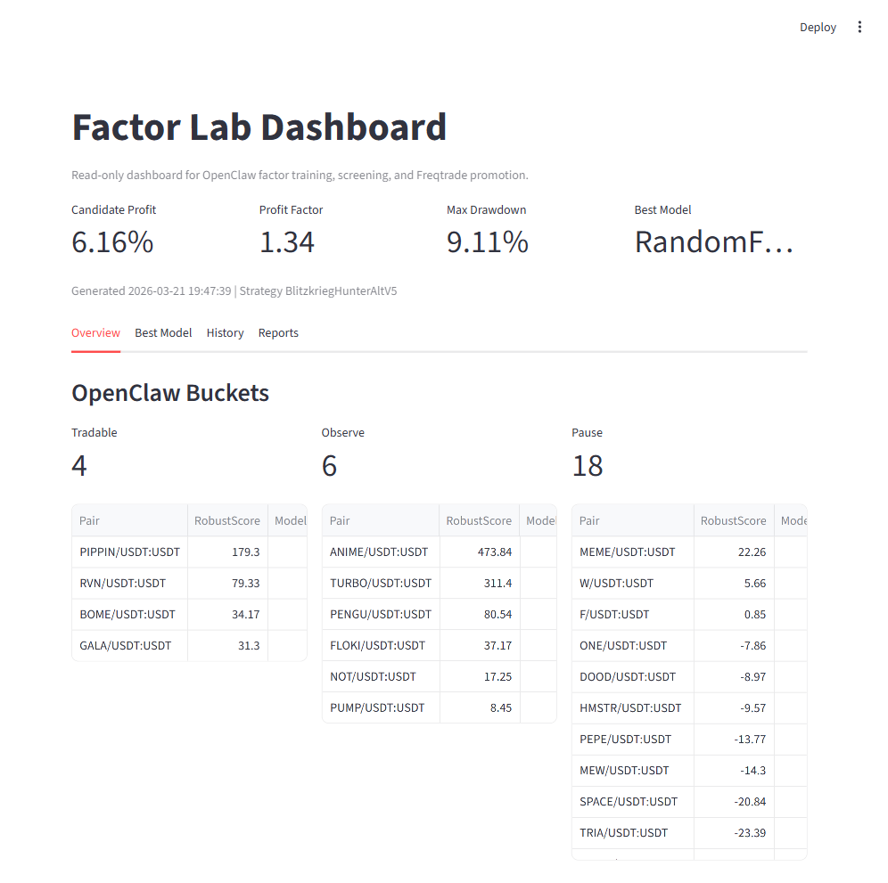
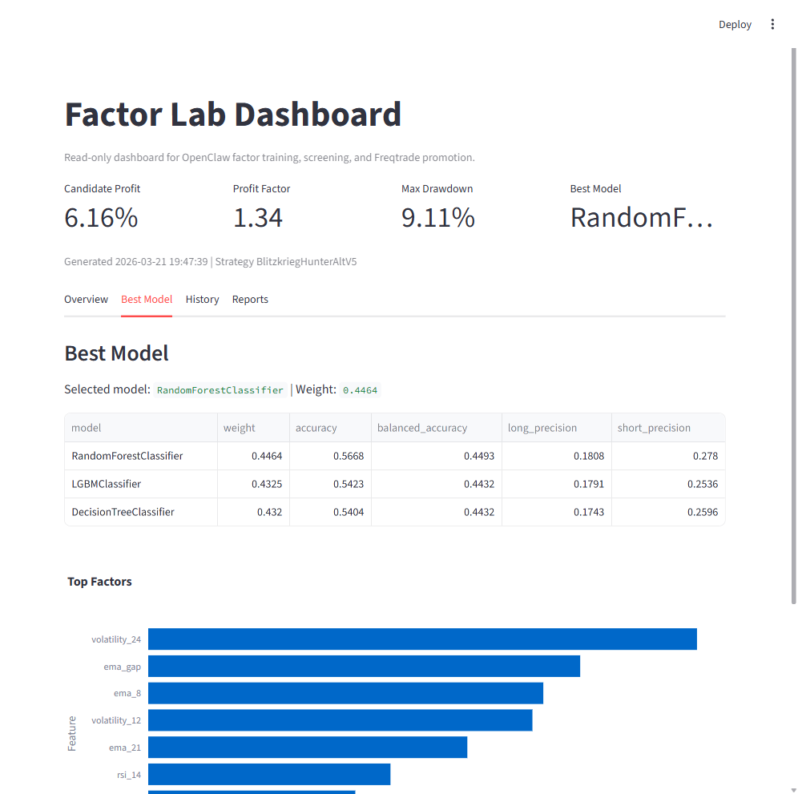

# OpenClaw + Freqtrade Local Workspace


中文 | English

本项目是一个本地量化工作区：`OpenClaw` 负责因子筛选、模型训练、审批与自动化流程，`Freqtrade` 负责 dry-run 执行。  
This project is a local quant workspace: `OpenClaw` handles factor screening, model training, approval, and automation; `Freqtrade` handles dry-run execution.

Project icon files:
- PNG: [assets/openclaw-freqtrade-icon.png](assets/openclaw-freqtrade-icon.png)
- ICO: [assets/openclaw-freqtrade-icon.ico](assets/openclaw-freqtrade-icon.ico)

## Overview

当前运行结构：
- Alt lane: `AlternativeHunter` + `OpenClaw stable/fast/autotune`
- Mainstream lane: `MainstreamHunter` on a separate bot
- Dashboard: read-only monitoring and reports
- GUI: local control center for daemons, bots, logs, and docs

Current runtime structure:
- Alt lane: `AlternativeHunter` + `OpenClaw stable/fast/autotune`
- Mainstream lane: `MainstreamHunter` on a separate bot
- Dashboard: read-only monitoring and reports
- GUI: local control center for daemons, bots, logs, and docs

## Screenshots

### Dashboard Overview


### Best Model View


## Runtime Layout

### 1. Fast
- Lightweight screening
- Refreshes local factor outputs
- Does not promote active config

### 2. Stable
- Full multi-model workflow
- Builds candidate config
- Runs candidate backtest
- Promotes into active config only when gates pass

### 3. Evolution
- Manual research only
- Not part of the live promotion path

### 4. Autotune
- Runtime tuning search for `AlternativeHunter`
- Low-frequency background process
- Does not affect live unless approved output is written

## Approval Gates

Current stable approval gates:
- Profit `>= 15%`
- Profit factor `>= 1.9`
- Max drawdown `<= 8.5%`
- Sortino `>= 7`
- Calmar `>= 45`
- Trades `>= 180`

## Active Systems

### Alt Bot
- Strategy: `AlternativeHunter`
- API: [http://127.0.0.1:8081](http://127.0.0.1:8081)
- Config: [user_data/config.openclaw-auto.json](user_data/config.openclaw-auto.json)

### Mainstream Bot
- Strategy: `MainstreamHunter`
- API: [http://127.0.0.1:8082](http://127.0.0.1:8082)
- Config: [user_data/config.mainstream-auto.json](user_data/config.mainstream-auto.json)

Isolation between the two bots:
- separate config files
- separate API ports
- separate SQLite databases
- separate containers

## Quick Start

### GUI Control Center

Open:
- [OpenClaw Control Center GUI.cmd](OpenClaw%20Control%20Center%20GUI.cmd)

Capabilities:
- start/stop `fast`
- start/stop `stable`
- start/stop `evolution`
- start/stop `autotune`
- open dashboard, logs, reports, and guides
- start alt/mainstream bots

### Read-only Dashboard

```powershell
powershell -ExecutionPolicy Bypass -File C:\Users\Administrator\Documents\Playground\freqtrade-local\start-factor-lab.ps1
```

Open:
- [http://127.0.0.1:8501](http://127.0.0.1:8501)

### Strategy Debug Lab

```powershell
cmd /c "C:\Users\Administrator\Documents\Playground\freqtrade-local\Launch Strategy Debug Lab.cmd"
```

Open:
- [http://127.0.0.1:8502](http://127.0.0.1:8502)

## Main Commands

### Daemons

Fast:
```powershell
powershell -ExecutionPolicy Bypass -File C:\Users\Administrator\Documents\Playground\freqtrade-local\start-openclaw-factor-daemon-fast.ps1
```

Stable:
```powershell
powershell -ExecutionPolicy Bypass -File C:\Users\Administrator\Documents\Playground\freqtrade-local\start-openclaw-factor-daemon-stable.ps1
```

Evolution:
```powershell
powershell -ExecutionPolicy Bypass -File C:\Users\Administrator\Documents\Playground\freqtrade-local\start-openclaw-factor-daemon-evolution.ps1
```

Autotune:
```powershell
powershell -ExecutionPolicy Bypass -File C:\Users\Administrator\Documents\Playground\freqtrade-local\start-openclaw-factor-daemon-autotune.ps1
```

### Bots

Alt bot:
```powershell
powershell -ExecutionPolicy Bypass -File C:\Users\Administrator\Documents\Playground\freqtrade-local\start-openclaw-auto-bot.ps1
```

Mainstream bot:
```powershell
powershell -ExecutionPolicy Bypass -File C:\Users\Administrator\Documents\Playground\freqtrade-local\start-mainstream-auto-bot.ps1
```

### Startup

Windows login startup entry:
- [Start OpenClaw On Login.cmd](Start%20OpenClaw%20On%20Login.cmd)

Script:
```powershell
powershell -ExecutionPolicy Bypass -File C:\Users\Administrator\Documents\Playground\freqtrade-local\start-openclaw-on-login.ps1
```

## Key Files

Workspace:
- [factor_lab.py](factor_lab.py)
- [strategy_debug_lab.py](strategy_debug_lab.py)
- [start-openclaw-control-center-gui.py](start-openclaw-control-center-gui.py)
- [OPENCLAW_FREQTRADE_GUIDE.md](OPENCLAW_FREQTRADE_GUIDE.md)
- [ALTERNATIVEHUNTER_TUNING_GUIDE_CN.md](ALTERNATIVEHUNTER_TUNING_GUIDE_CN.md)

Strategies:
- [user_data/strategies/AlternativeHunter.py](user_data/strategies/AlternativeHunter.py)
- [user_data/strategies/MainstreamHunter.py](user_data/strategies/MainstreamHunter.py)

Workflow scripts:
- [../openclaw/scripts/freqtrade-daily-ml-screen.ps1](../openclaw/scripts/freqtrade-daily-ml-screen.ps1)
- [../openclaw/scripts/freqtrade-backtest-openclaw-auto.ps1](../openclaw/scripts/freqtrade-backtest-openclaw-auto.ps1)
- [../openclaw/scripts/freqtrade-sync-screen-to-config.ps1](../openclaw/scripts/freqtrade-sync-screen-to-config.ps1)

## Security

Not committed:
- exchange API credentials
- Telegram token / chat id
- live runtime secrets
- local market data
- local logs
- local report outputs
- backtest result zips
- SQLite databases

Template files:
- [openclaw.notification.example.json](openclaw.notification.example.json)
- [user_data/config.example.json](user_data/config.example.json)
- [user_data/config.openclaw-auto.example.json](user_data/config.openclaw-auto.example.json)

## Documentation

- [OPENCLAW_FREQTRADE_GUIDE.md](OPENCLAW_FREQTRADE_GUIDE.md)
- [STRATEGY_DEBUG_LAB.md](STRATEGY_DEBUG_LAB.md)
- [ALTERNATIVEHUNTER_TUNING_GUIDE_CN.md](ALTERNATIVEHUNTER_TUNING_GUIDE_CN.md)
- [ML_TRAINING.md](ML_TRAINING.md)
- [FACTOR_LAB.md](FACTOR_LAB.md)
