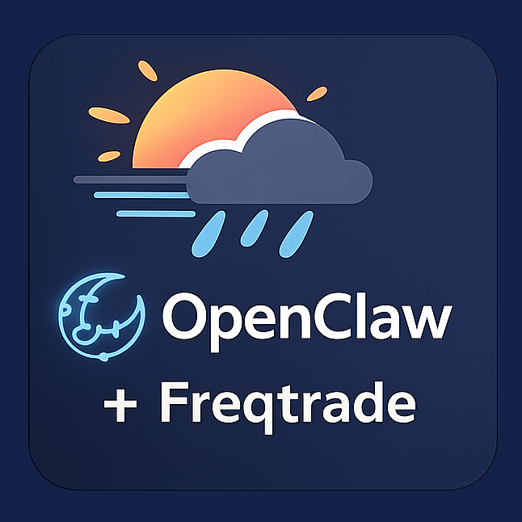
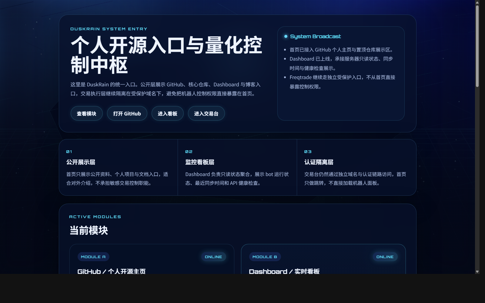
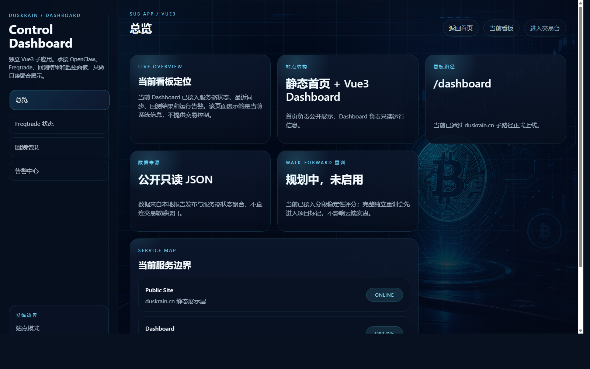
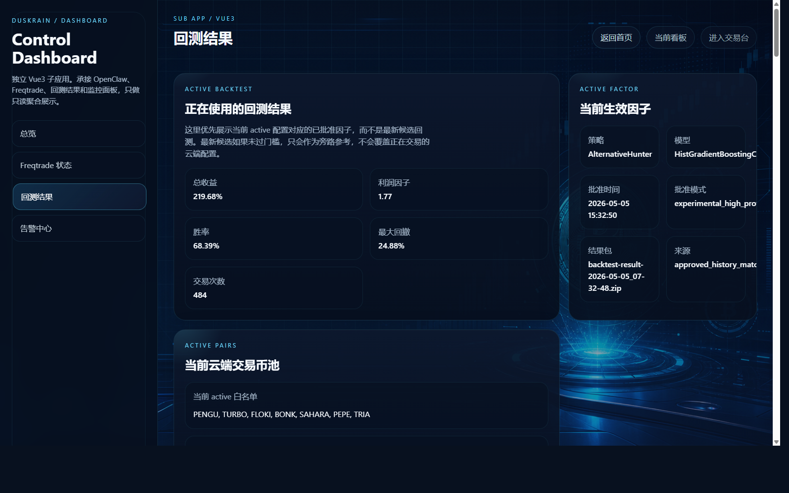
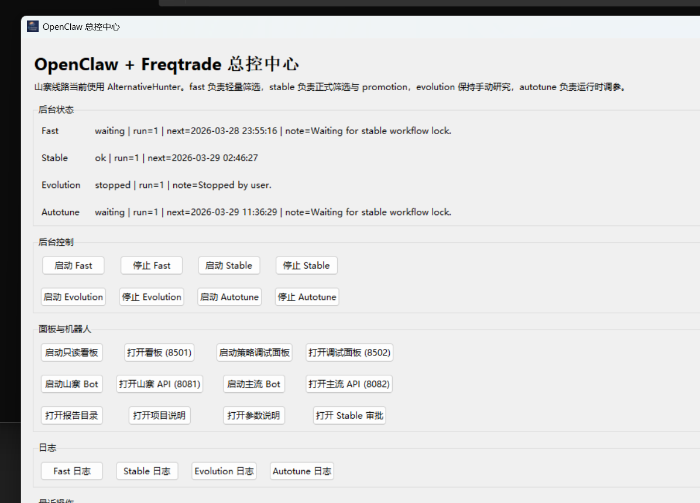
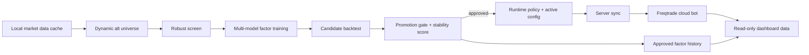

<h1 align="center">OpenClaw + Freqtrade Quant Control Platform</h1>

<p align="center">
  
</p>

<p align="center">
  Local factor research, dynamic altcoin screening, Freqtrade cloud execution, and read-only live dashboards.
</p>

<p align="center">
  
  
  
</p>

<p align="center">
  
  
  
  
</p>

<p align="center">
  <a href="https://duskrain.cn">
    
  </a>
  <a href="https://duskrain.cn/dashboard/">
    
  </a>
  <a href="README.zh-CN.md">
    
  </a>
</p>

<p align="center">
  <a href="README.md">English</a> | <a href="README.zh-CN.md">涓枃</a>
</p>

OpenClaw + Freqtrade is a local-to-cloud quantitative trading research platform. The local machine handles data refresh, altcoin universe screening, multi-model factor training, backtesting, approval, and runtime policy generation. The server runs the protected Freqtrade bot and exposes read-only public dashboards.

This repository is designed as a personal research and automation workspace, not a plug-and-play trading signal service.

## Project Introduction

This project has been upgraded from a script-style workspace into a local quantitative trading control platform.

- Local lane: refreshes and caches market data, builds a dynamic altcoin universe, trains factor models, runs backtests, applies approval gates, and prepares runtime policies.
- Cloud lane: runs Freqtrade, receives approved active configurations, restarts the bot when needed, and publishes read-only runtime/position snapshots.
- Dashboard lane: shows approved factors, current active model, backtest metrics, live bot status, server sync state, alerts, and project roadmap markers.
- Control lane: the desktop GUI keeps common actions in one place, including daemon control, local dashboard launch, server sync, report access, and safe GitHub publishing.

## Highlights

- Dynamic altcoin universe based on local OKX futures data, liquidity, market-cap filters, volatility, funding risk, and BTC/ETH market regime.
- Multi-model factor training with tree models, Random Forest, HistGradientBoosting, XGBoost, and optional GPU-oriented workflow hooks.
- `AlternativeHunter` strategy with model-driven pair selection, runtime policy, direction bias, stake scaling, leverage cap, and volatility targeting.
- Promotion gate that checks profit, profit factor, winrate, drawdown, trade count, historical approved factors, and stability scoring.
- Cloud execution lane with Freqtrade live runtime, protected HTTPS access, Authenticator authentication, and server sync protection.
- Read-only Vue dashboard for active factor, backtest details, live bot status, alerts, approved factor history, and roadmap markers.
- Local GUI control center for starting/stopping background model daemons, opening reports, syncing to server, and safe GitHub publishing.

## Public Pages

- Landing page: [https://duskrain.cn](https://duskrain.cn)
- Read-only dashboard: [https://duskrain.cn/dashboard/](https://duskrain.cn/dashboard/)
- Backtest view: [https://duskrain.cn/dashboard/backtest](https://duskrain.cn/dashboard/backtest)
- Protected Freqtrade entry: [https://www.duskrain.cn](https://www.duskrain.cn)
- Blog placeholder: [https://blog.duskrain.cn](https://blog.duskrain.cn)

## Screenshots

### Landing Page


### Dashboard Overview


### Backtest Detail


### Local Control Center


## Architecture


```mermaid
flowchart LR
    A[Local market data cache] --> B[Dynamic alt universe]
    B --> C[Robust screen]
    C --> D[Multi-model factor training]
    D --> E[Candidate backtest]
    E --> F[Promotion gate + stability score]
    F -->|approved| G[Runtime policy + active config]
    G --> H[Server sync]
    H --> I[Freqtrade cloud bot]
    I --> J[Read-only dashboard data]
    F --> K[Approved factor history]
    K --> J
```

## Current Workflow

### `fast`

- Lightweight screening lane.
- Uses dynamic universe data and model summaries.
- Intended for frequent observation and quick factor discovery.
- Does not automatically promote to the live server.

### `stable`

- Formal screening and promotion lane.
- Refreshes market data, rebuilds dynamic universe, trains multiple models, backtests candidates, runs approval gates, and can sync approved configs to the server.
- Uses dynamic market-cap/liquidity filters and recent BTC/ETH regime information.

### `autotune`

- Low-frequency runtime parameter tuning lane.
- Adjusts strategy-side thresholds and runtime policy only after approval.

### `evolution`

- Manual research lane.
- Kept separate from the default automated flow to avoid noisy or long-running experiments affecting stable promotion.

## Model And Factor Logic

Current factor training uses a multi-layer decision flow:

- Market regime: BTC/ETH trend and volatility classify the environment as risk-on, neutral, or risk-off.
- Cross-sectional ranking: altcoins are compared against each other by relative strength, volume, momentum, liquidity, and market-cap quality.
- Time-series confirmation: each coin is checked with trend confirmation, EMA structure, breakout position, consistency, and volatility penalty.
- Funding and mark premium: treated as risk and crowding signals, not as unlimited dominant factors.
- Runtime sizing: stake and leverage are adjusted by model score, recent score, regime scale, volatility scale, and trend confirmation.

## Promotion And Safety

The system does not replace the active live configuration just because a new candidate appears. A candidate must pass the approval gate and be compared against historical approved factors.

Current promoted-factor logic emphasizes:

- Total profit and profit factor.
- Winrate and max drawdown.
- Trade count protection.
- High-profit experimental channel with stricter risk visibility.
- Stability score: monthly consistency, single-pair concentration, drawdown duration, long/short imbalance, and segmented performance.
- Existing approved factor protection: weaker candidates do not overwrite the current active configuration.

## Roadmap Marker

`Independent walk-forward retraining` is now tracked as a project marker.

Current state:
- Segmented stability scoring is already connected to the approval gate.

Planned next step:
- Split train, validation, test, and recent windows into independent retraining and independent backtests.
- Merge segment scores before promotion.
- Keep the feature disabled until the cache, runtime queue, and promotion behavior are fully verified.

See [PROJECT_ROADMAP.json](PROJECT_ROADMAP.json).

## Quick Start

### GUI Control Center

Open:

```powershell
cmd /c "D:\Playground\freqtrade-local\launchers\OpenClaw Control Center GUI.cmd"
```

Main actions:

- Start or stop `fast`, `stable`, `evolution`, and `autotune`.
- Open local dashboards and report folders.
- Probe server connectivity.
- Manually sync approved runtime config to the server.
- Publish safe changes to GitHub without committing local secrets.

### Local Factor Lab

```powershell
powershell -ExecutionPolicy Bypass -File D:\Playground\freqtrade-local\scripts\windows\start-factor-lab.ps1
```

Open:

- [http://127.0.0.1:8501](http://127.0.0.1:8501)

### Strategy Debug Lab

```powershell
cmd /c "D:\Playground\freqtrade-local\launchers\Launch Strategy Debug Lab.cmd"
```

Open:

- [http://127.0.0.1:8502](http://127.0.0.1:8502)

## Common Commands

### Start Background Training

```powershell
powershell -ExecutionPolicy Bypass -File D:\Playground\freqtrade-local\scripts\windows\start-openclaw-factor-daemon-fast.ps1
powershell -ExecutionPolicy Bypass -File D:\Playground\freqtrade-local\scripts\windows\start-openclaw-factor-daemon-stable.ps1
powershell -ExecutionPolicy Bypass -File D:\Playground\freqtrade-local\scripts\windows\start-openclaw-factor-daemon-autotune.ps1
```

### Stop Background Training

```powershell
powershell -ExecutionPolicy Bypass -File D:\Playground\freqtrade-local\scripts\windows\stop-openclaw-factor-daemon-fast.ps1
powershell -ExecutionPolicy Bypass -File D:\Playground\freqtrade-local\scripts\windows\stop-openclaw-factor-daemon-stable.ps1
powershell -ExecutionPolicy Bypass -File D:\Playground\freqtrade-local\scripts\windows\stop-openclaw-factor-daemon-autotune.ps1
```

### Server Sync

```powershell
powershell -ExecutionPolicy Bypass -File D:\Playground\freqtrade-local\scripts\windows\sync-openclaw-runtime-to-server.ps1
```

### Cloud Position Sync

The server-side `openclaw-dashboard-status-sync.timer` writes the read-only live bot and position snapshot to `/dashboard-data/status.json`, and the Vue dashboard auto-refreshes it. This is now part of the server sync/runtime workflow, so the GUI no longer needs a separate "install position sync" button. Use the command below only for manual maintenance.

```powershell
powershell -ExecutionPolicy Bypass -File D:\Playground\freqtrade-local\scripts\windows\install-server-position-sync.ps1 -IntervalSeconds 60 -RunOnce
```

### Safe GitHub Sync

```powershell
powershell -ExecutionPolicy Bypass -File D:\Playground\freqtrade-local\scripts\windows\sync-github-safe.ps1
```

## Important Files

- [apps/desktop/control_center_gui.py](apps/desktop/control_center_gui.py): local GUI control center.
- [apps/streamlit/factor_lab.py](apps/streamlit/factor_lab.py): local read-only factor dashboard implementation.
- [apps/streamlit/strategy_debug_lab.py](apps/streamlit/strategy_debug_lab.py): strategy backtest/debug dashboard implementation.
- [apps/streamlit/telegram_template_lab.py](apps/streamlit/telegram_template_lab.py): Telegram message template dashboard implementation.
- [scripts/workflows/build_dynamic_alt_universe.py](scripts/workflows/build_dynamic_alt_universe.py): dynamic universe builder.
- [scripts/workflows/evaluate_backtest_stability.py](scripts/workflows/evaluate_backtest_stability.py): stability and segmented backtest evaluator.
- [scripts/workflows/publish_dashboard_public_data.py](scripts/workflows/publish_dashboard_public_data.py): dashboard data publisher.
- [scripts/workflows/sync_openclaw_runtime_to_server.py](scripts/workflows/sync_openclaw_runtime_to_server.py): cloud sync helper.
- [user_data/strategies/AlternativeHunter.py](user_data/strategies/AlternativeHunter.py): active altcoin strategy.
- [PROJECT_ROADMAP.json](PROJECT_ROADMAP.json): current project markers and planned upgrades.
- [docs/PROJECT_STRUCTURE.md](docs/PROJECT_STRUCTURE.md): repository layout and organization notes.

## Security

The repository is configured to avoid publishing private runtime material:

- Exchange API credentials.
- Telegram tokens and chat IDs.
- Server sync credentials.
- Local market data cache.
- Backtest result zips.
- Reports, daemon logs, and SQLite databases.
- Live runtime configs containing secrets.

Template files are provided where possible:

- [openclaw.notification.example.json](openclaw.notification.example.json)
- [server.openclaw-sync.example.json](server.openclaw-sync.example.json)
- [user_data/config.example.json](user_data/config.example.json)
- [user_data/config.openclaw-auto.example.json](user_data/config.openclaw-auto.example.json)

## Disclaimer

This is a research and small-capital automation project. Crypto futures and altcoins are volatile, illiquid at times, and risky under leverage. Backtests and model scores do not guarantee future returns.

