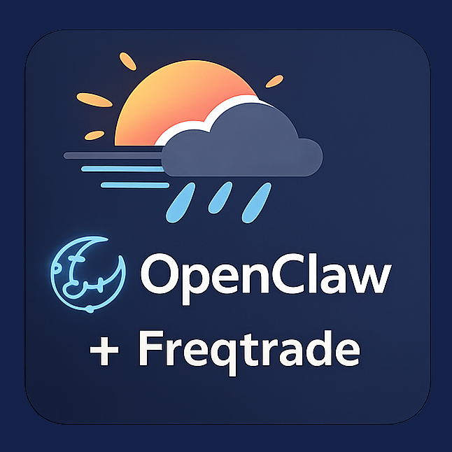
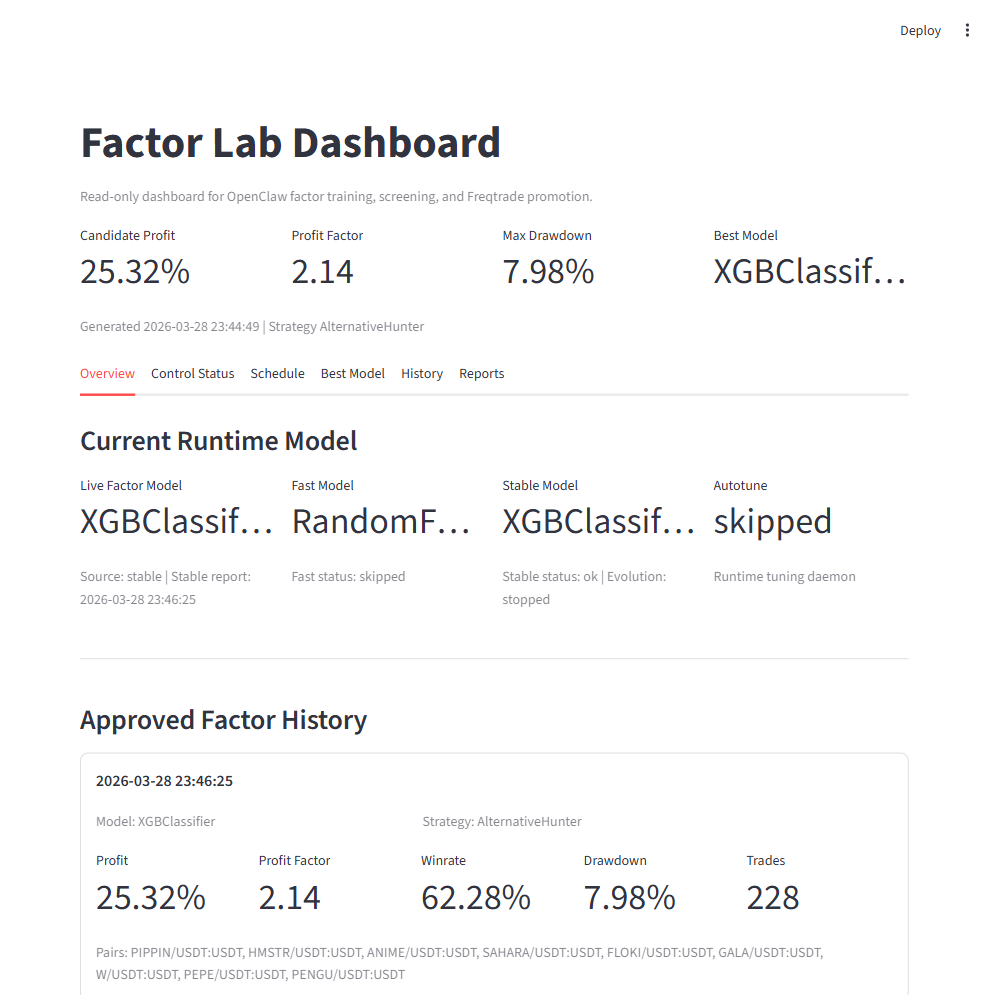
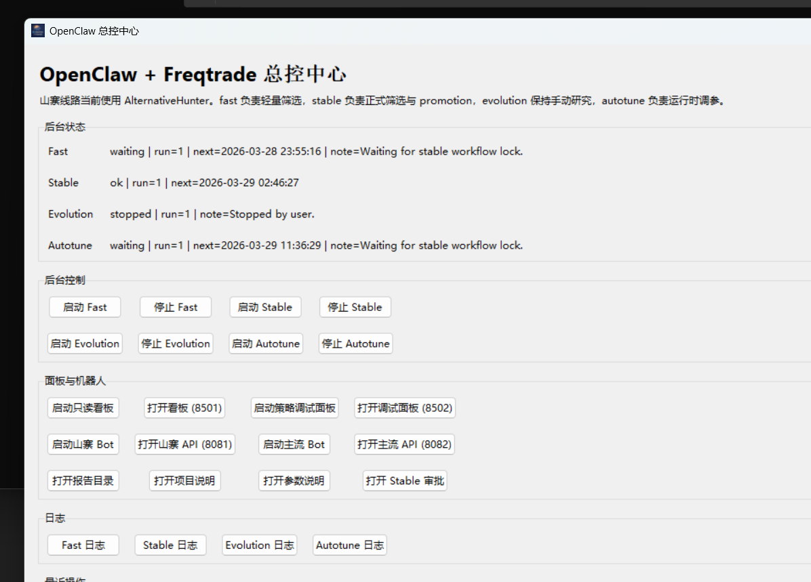

# OpenClaw + Freqtrade 本地量化工作区



[English](README.md) | [中文](README.zh-CN.md)

这是一个围绕 `OpenClaw` 和 `Freqtrade` 搭建的本地量化研究与执行工作区。

- `OpenClaw` 负责因子筛选、模型训练、审批和自动化流程。
- `Freqtrade` 负责 dry-run 执行，以及服务器侧的 Bot 运行。
- 山寨与主流两条研究线按配置、端口、数据库和容器隔离。

另见：
- [项目概览（EN）](PROJECT_OVERVIEW.md)
- [项目概览（中文）](PROJECT_OVERVIEW.zh-CN.md)

## 当前公开入口

- 首页：[https://duskrain.cn](https://duskrain.cn)
- Vue 看板：[https://duskrain.cn/dashboard/](https://duskrain.cn/dashboard/)
- 博客：[https://blog.duskrain.cn](https://blog.duskrain.cn)
- 受保护的 Freqtrade UI：[https://www.duskrain.cn](https://www.duskrain.cn)

## 当前架构

### 本地研究链路
- 动态山寨币池生成
- Robust Screen
- 树模型训练（`tree`、`rf`、`hgb`、`xgb`）
- 候选回测
- 审批门槛
- 可选服务器同步

### 服务器执行链路
- Freqtrade Bot 执行
- HTTPS + Authenticator 保护的 UI
- 对外公开的只读看板数据

## 当前自动化布局

### `stable`
- 正式筛选链路
- 启用本地行情刷新
- 启用动态币池
- 当前动态币池宽度：`top_n = 15`
- 自动回测窗口模式：`auto`

### `fast`
- 轻量筛选链路
- 不下载行情
- 启用动态币池
- 当前动态币池宽度：`top_n = 20`
- 不做自动回测，不做 promotion

### `evolution`
- 仅手动研究

### `autotune`
- 低频运行时调参

## Stable 审批门槛

当前 stable promotion 门槛：
- 收益 `>= 15%`
- 盈利因子 `>= 1.9`
- 最大回撤 `<= 8.5%`
- Sortino `>= 7`
- Calmar `>= 45`
- 交易数 `>= 180`
- 仅当收益 `>= 18%` 时可绕过交易数门槛

## 截图

### 看板总览


### 总控 GUI


## 快速开始

### GUI 总控中心

打开：
- [OpenClaw Control Center GUI.cmd](OpenClaw%20Control%20Center%20GUI.cmd)

主要功能：
- 启动或停止 `fast`
- 启动或停止 `stable`
- 启动或停止 `evolution`
- 启动或停止 `autotune`
- 打开看板、报告和后台日志
- 手动把当前运行时配置同步到服务器

### 本地只读看板

```powershell
powershell -ExecutionPolicy Bypass -File C:\Users\Administrator\Documents\Playground\freqtrade-local\start-factor-lab.ps1
```

打开：
- [http://127.0.0.1:8501](http://127.0.0.1:8501)

### 策略调试面板

```powershell
cmd /c "C:\Users\Administrator\Documents\Playground\freqtrade-local\Launch Strategy Debug Lab.cmd"
```

打开：
- [http://127.0.0.1:8502](http://127.0.0.1:8502)

## 主要命令

### Daemon

Fast：
```powershell
powershell -ExecutionPolicy Bypass -File C:\Users\Administrator\Documents\Playground\freqtrade-local\start-openclaw-factor-daemon-fast.ps1
```

Stable：
```powershell
powershell -ExecutionPolicy Bypass -File C:\Users\Administrator\Documents\Playground\freqtrade-local\start-openclaw-factor-daemon-stable.ps1
```

Evolution：
```powershell
powershell -ExecutionPolicy Bypass -File C:\Users\Administrator\Documents\Playground\freqtrade-local\start-openclaw-factor-daemon-evolution.ps1
```

Autotune：
```powershell
powershell -ExecutionPolicy Bypass -File C:\Users\Administrator\Documents\Playground\freqtrade-local\start-openclaw-factor-daemon-autotune.ps1
```

### Bot

山寨 Bot：
```powershell
powershell -ExecutionPolicy Bypass -File C:\Users\Administrator\Documents\Playground\freqtrade-local\start-openclaw-auto-bot.ps1
```

主流 Bot：
```powershell
powershell -ExecutionPolicy Bypass -File C:\Users\Administrator\Documents\Playground\freqtrade-local\start-mainstream-auto-bot.ps1
```

## 关键文件

工作区：
- [factor_lab.py](factor_lab.py)
- [strategy_debug_lab.py](strategy_debug_lab.py)
- [start-openclaw-control-center-gui.py](start-openclaw-control-center-gui.py)
- [runtime_state.py](runtime_state.py)

动态币池流程：
- [build_dynamic_alt_universe.py](build_dynamic_alt_universe.py)
- [refresh_alt_market_data.ps1](refresh_alt_market_data.ps1)
- [compare_dynamic_universe_topn.ps1](compare_dynamic_universe_topn.ps1)
- 本地配套工作流脚本：`../openclaw/scripts/freqtrade-daily-ml-screen.ps1`

策略：
- [user_data/strategies/AlternativeHunter.py](user_data/strategies/AlternativeHunter.py)
- [user_data/strategies/MainstreamHunter.py](user_data/strategies/MainstreamHunter.py)

## 安全说明

不会提交到仓库：
- 交易所 API 凭据
- Telegram token / chat id
- 服务器同步本地密钥
- 本地行情数据
- 报告和日志
- 回测结果 zip
- SQLite 数据库

模板文件：
- [openclaw.notification.example.json](openclaw.notification.example.json)
- [user_data/config.example.json](user_data/config.example.json)
- [user_data/config.openclaw-auto.example.json](user_data/config.openclaw-auto.example.json)
- [server.openclaw-sync.example.json](server.openclaw-sync.example.json)

## 文档

- [项目概览（EN）](PROJECT_OVERVIEW.md)
- [项目概览（中文）](PROJECT_OVERVIEW.zh-CN.md)
- [OPENCLAW_FREQTRADE_GUIDE.md](OPENCLAW_FREQTRADE_GUIDE.md)
- [STRATEGY_DEBUG_LAB.md](STRATEGY_DEBUG_LAB.md)
- [ALTERNATIVEHUNTER_TUNING_GUIDE_CN.md](ALTERNATIVEHUNTER_TUNING_GUIDE_CN.md)
- [ML_TRAINING.md](ML_TRAINING.md)
- [FACTOR_LAB.md](FACTOR_LAB.md)
