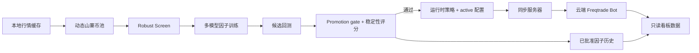

<h1 align="center">OpenClaw + Freqtrade 本地量化交易控制平台</h1>

<p align="center">
  
</p>

<p align="center">
  本地因子研究、动态山寨币筛选、Freqtrade 云端执行、只读实盘看板。
</p>

<p align="center">
  
  
  
</p>

<p align="center">
  <a href="https://duskrain.cn">
    
  </a>
  <a href="https://duskrain.cn/dashboard/">
    
  </a>
  <a href="README.md">
    
  </a>
</p>

<p align="center">
  <a href="README.md">English</a> | <a href="README.zh-CN.md">中文</a>
</p>

OpenClaw + Freqtrade 是一套“本地研究 + 云端执行”的个人量化交易控制平台。本地机器负责行情回补、动态山寨币池、因子模型训练、回测、审批和运行时策略生成；服务器负责运行受保护的 Freqtrade 机器人，并对外展示只读看板。

这个仓库是个人研究与自动化工作台，不是开箱即用的交易信号服务。

## 项目简介

项目已经从“脚本型工作区”升级为“本地量化交易控制平台”。

- 本地链路：刷新并缓存行情数据，生成动态山寨币池，训练因子模型，执行回测和审批，生成 active 配置与运行时策略。
- 云端链路：运行 Freqtrade，接收通过审批的 active 配置，必要时重启机器人，并发布只读运行状态和持仓快照。
- 看板链路：展示已批准因子、当前 active 模型、回测指标、实盘 Bot 状态、服务器同步状态、告警和项目路线标记。
- 总控链路：桌面 GUI 集中处理后台任务控制、本地看板启动、服务器同步、报告查看和安全 GitHub 同步。

## 核心能力

- 动态山寨币池：结合 OKX 合约本地数据、成交量、流动性、市值过滤、波动率、资金费率风险和 BTC/ETH 市场状态。
- 多模型因子训练：支持树模型、随机森林、HistGradientBoosting、XGBoost，并预留 GPU 工作流接口。
- `AlternativeHunter` 山寨策略：接入模型选币、运行时策略、方向偏置、仓位缩放、杠杆上限和波动率目标。
- Promotion 审批门槛：检查收益、利润因子、胜率、回撤、交易次数、历史已批准因子和稳定性评分。
- Walk-forward 独立重训：在验证期、测试期和最近窗口分别重训模型，用于检查模型是否只在单一区间过拟合。
- 云端执行链路：Freqtrade 实盘运行、HTTPS 访问、Authenticator 认证和服务器同步保护。
- Vue 只读看板：展示 active 因子、回测详情、实盘 Bot 状态、告警、已批准因子历史和 roadmap 标记。
- 本地 GUI 总控：启动/停止后台模型任务、打开报告、同步服务器、一键安全同步 GitHub。

## 公开入口

- 首页：[https://duskrain.cn](https://duskrain.cn)
- 只读看板：[https://duskrain.cn/dashboard/](https://duskrain.cn/dashboard/)
- 回测结果页：[https://duskrain.cn/dashboard/backtest](https://duskrain.cn/dashboard/backtest)
- 受保护 Freqtrade 入口：[https://www.duskrain.cn](https://www.duskrain.cn)
- 博客占位页：[https://blog.duskrain.cn](https://blog.duskrain.cn)

## 截图

### 网站首页


### Dashboard 总览


### 回测结果详情


### 本地 GUI 总控


## 系统架构


```mermaid
flowchart LR
    A[本地行情缓存] --> B[动态山寨币池]
    B --> C[Robust Screen]
    C --> D[多模型因子训练]
    D --> E[候选回测]
    E --> F[Promotion gate + 稳定性评分]
    F -->|通过| G[运行时策略 + active 配置]
    G --> H[同步服务器]
    H --> I[云端 Freqtrade Bot]
    I --> J[只读看板数据]
    F --> K[已批准因子历史]
    K --> J
```

## 当前工作流

### `fast`

- 轻量筛选链路。
- 用于更频繁地观察动态币池和模型摘要。
- 不自动 promotion，不直接改云端实盘。

### `stable`

- 正式筛选和 promotion 链路。
- 刷新行情、生成动态币池、训练多模型、回测候选、执行审批 gate，并在通过后同步云端。
- 接入市值/流动性过滤，以及 BTC/ETH 市场状态。
- 已接入 walk-forward 独立重训，当前为 report-only，不会直接阻断 promotion。

### `autotune`

- 低频运行时参数推演。
- 只有通过审批后才影响策略侧阈值或运行时策略。

### `evolution`

- 手动研究链路。
- 默认不进入自动化主流程，避免长时间或高噪声实验影响 stable promotion。

## 因子与模型逻辑

当前因子训练不是单一模型选币，而是分层决策：

- 市场状态：用 BTC/ETH 趋势和波动判断 risk-on、neutral、risk-off。
- 横截面排名：比较山寨币之间的相对强弱、成交量、动量、流动性和市值质量。
- 时间序列确认：检查单币趋势确认、EMA 结构、突破位置、趋势一致性和波动惩罚。
- 资金费率与 mark premium：作为风险/拥挤度因子，不允许无限主导模型。
- 运行时仓位：由模型分数、近期分数、市场状态、波动率缩放和趋势确认共同决定仓位与杠杆上限。

## Promotion 与安全逻辑

系统不会因为出现新候选因子就直接替换当前实盘配置。候选需要通过审批门槛，并和历史已批准因子比较。

当前重点检查：

- 总收益与利润因子。
- 胜率与最大回撤。
- 交易次数下限保护。
- 高收益高风险实验通道。
- 稳定性评分：月度一致性、单币贡献集中度、回撤持续时间、多空失衡和分段表现。
- 历史最优保护：明显弱于当前 active 因子的候选不会覆盖实盘。

## Walk-forward 重训

`完整独立 walk-forward 重训` 已加入项目标记，并开始接入 stable 链路。

当前状态：

- 新增 `scripts/workflows/run_walk_forward_retrain.py`。
- 支持多个独立窗口重训：验证期、测试期、最近窗口。
- 每个窗口独立训练模型，输出 JSON 和 Markdown 报告。
- `stable` 后台已接入该流程，但当前为 report-only。
- 看板会展示 walk-forward 通过情况、窗口评分、主导模型、样本量和硬阻断原因。

默认窗口：

- 验证窗口：训练 `2025-01-01` 到 `2025-10-01`，测试 `2025-10-01` 到 `2026-02-01`。
- 测试窗口：训练 `2025-01-01` 到 `2026-02-01`，测试 `2026-02-01` 到最新数据。
- 最近窗口：用最近约 60 天作为测试窗口，前置约 300 天作为训练窗口。

下一步：

- 观察 2-3 轮 stable 结果。
- 如果窗口通过率稳定，再考虑把 `WalkForwardRetrainGate` 从 `0` 改为 `1`，让它成为强制 promotion gate。

详见：[PROJECT_ROADMAP.json](PROJECT_ROADMAP.json)

## 快速启动

### GUI 总控中心

```powershell
cmd /c "D:\Playground\freqtrade-local\launchers\OpenClaw Control Center GUI.cmd"
```

主要功能：

- 启动/停止 `fast`、`stable`、`evolution`、`autotune`。
- 打开本地看板、报告和日志目录。
- 探测服务器连通性。
- 手动同步已批准的 active 配置到服务器。
- 安全同步 GitHub，避免提交本地密钥和数据。

### 本地因子看板

```powershell
powershell -ExecutionPolicy Bypass -File D:\Playground\freqtrade-local\scripts\windows\start-factor-lab.ps1
```

打开：

- [http://127.0.0.1:8501](http://127.0.0.1:8501)

### 策略调试面板

```powershell
cmd /c "D:\Playground\freqtrade-local\launchers\Launch Strategy Debug Lab.cmd"
```

打开：

- [http://127.0.0.1:8502](http://127.0.0.1:8502)

## 常用命令

### 启动后台训练

```powershell
powershell -ExecutionPolicy Bypass -File D:\Playground\freqtrade-local\scripts\windows\start-openclaw-factor-daemon-fast.ps1
powershell -ExecutionPolicy Bypass -File D:\Playground\freqtrade-local\scripts\windows\start-openclaw-factor-daemon-stable.ps1
powershell -ExecutionPolicy Bypass -File D:\Playground\freqtrade-local\scripts\windows\start-openclaw-factor-daemon-autotune.ps1
```

### 停止后台训练

```powershell
powershell -ExecutionPolicy Bypass -File D:\Playground\freqtrade-local\scripts\windows\stop-openclaw-factor-daemon-fast.ps1
powershell -ExecutionPolicy Bypass -File D:\Playground\freqtrade-local\scripts\windows\stop-openclaw-factor-daemon-stable.ps1
powershell -ExecutionPolicy Bypass -File D:\Playground\freqtrade-local\scripts\windows\stop-openclaw-factor-daemon-autotune.ps1
```

### 服务器同步

```powershell
powershell -ExecutionPolicy Bypass -File D:\Playground\freqtrade-local\scripts\windows\sync-openclaw-runtime-to-server.ps1
```

### Walk-forward 手动重训

```powershell
python D:\Playground\freqtrade-local\scripts\workflows\run_walk_forward_retrain.py `
  --project-root D:\Playground\freqtrade-local `
  --config-path D:\Playground\freqtrade-local\user_data\config.backtest.okx-futures-alt-local-dynamic.generated.json `
  --output-json D:\Playground\freqtrade-local\reports\openclaw-walk-forward-retrain-manual.json `
  --output-md D:\Playground\freqtrade-local\reports\openclaw-walk-forward-retrain-manual.md
```

### 安全 GitHub 同步

```powershell
powershell -ExecutionPolicy Bypass -File D:\Playground\freqtrade-local\scripts\windows\sync-github-safe.ps1
```

## 重要文件

- [apps/desktop/control_center_gui.py](apps/desktop/control_center_gui.py)：本地 GUI 总控。
- [apps/streamlit/factor_lab.py](apps/streamlit/factor_lab.py)：本地只读因子看板。
- [apps/streamlit/strategy_debug_lab.py](apps/streamlit/strategy_debug_lab.py)：策略回测/调试面板。
- [scripts/workflows/build_dynamic_alt_universe.py](scripts/workflows/build_dynamic_alt_universe.py)：动态币池构建。
- [scripts/workflows/evaluate_backtest_stability.py](scripts/workflows/evaluate_backtest_stability.py)：稳定性与分段回测评估。
- [scripts/workflows/run_walk_forward_retrain.py](scripts/workflows/run_walk_forward_retrain.py)：独立 walk-forward 重训。
- [scripts/workflows/sync_openclaw_runtime_to_server.py](scripts/workflows/sync_openclaw_runtime_to_server.py)：云端同步辅助。
- [user_data/strategies/AlternativeHunter.py](user_data/strategies/AlternativeHunter.py)：当前山寨策略。
- [PROJECT_ROADMAP.json](PROJECT_ROADMAP.json)：项目标记和后续升级计划。
- [docs/PROJECT_STRUCTURE.md](docs/PROJECT_STRUCTURE.md)：仓库结构说明。

## 安全说明

仓库已配置为避免发布私有运行材料：

- 交易所 API 凭据。
- Telegram token 和 chat ID。
- 服务器同步凭据。
- 本地行情缓存。
- 回测结果 zip。
- 报告、daemon 日志和 SQLite 数据库。
- 包含密钥的实盘运行配置。

## 风险声明

这是研究和小资金自动化项目。Crypto 合约和山寨币波动大、流动性会变化，杠杆风险高。回测结果和模型评分不保证未来收益。
